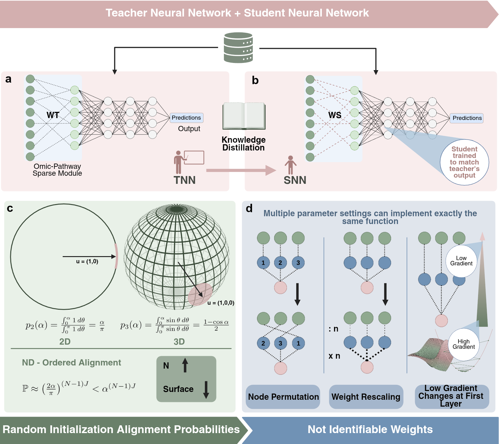

# The illusion of interpretability in biologically informed neural networks

This repository contains the code, results, and figures for the paper:

> **The illusion of interpretability in biologically informed neural networks**

The project investigates whether embedding biological structure, such as gene–pathway relationships, into neural network architectures is sufficient to guarantee meaningful mechanistic interpretability. We show that topology-constrained biologically informed neural networks can accurately reproduce the teacher input–output function while failing to recover the underlying biological weights and pathway-level activations.

---

## Graphical Abstract



---

## Repository Structure

```text
.
├── Code/
│   ├── pathway_tasks_complete.py
│   └── pathway_tasks_supervision.py
├── Figures/
│   ├── Graphical_Abstract.png
│   └── (all figures used in the paper)
├── Results_Parameter_Level/
│   ├── (parameter-level recovery metrics)
│   └── (scripts to reproduce parameter-level figures)
├── Results_Activation_Level/
│   ├── (activation-level recovery metrics)
│   └── (scripts to reproduce activation-level figures)
└── README.md
```

---

## Code

The `Code/` folder contains the main scripts used in the study.

### `pathway_tasks_complete.py`

This script reproduces the main teacher–student experiments used to test whether topology-constrained biologically informed neural networks recover the internal biological structure of the teacher model under output-only training.

It includes:

* output-only teacher–student distillation;
* parameter-level recovery analysis of first-layer gene-to-pathway weights;
* activation-level recovery analysis of pathway-node activations;
* prediction tasks across binary classification, multiclass classification, regression and survival analysis;
* sensitivity analyses over biological structure and network architecture.

### `pathway_tasks_supervision.py`

This script reproduces the objective-level anchoring experiments. These experiments test whether adding explicit internal supervision can restore recovery of the biologically annotated first layer.

It includes:

* output-only baseline;
* direct first-layer weight supervision;
* pathway-activation supervision;
* noisy activation supervision;
* partial activation supervision;
* proxy activation supervision through low-dimensional linear mixtures;
* random and shuffled activation negative controls;
* sweeps over mask density, pathway-layer size, supervision strength, activation noise and pathway coverage.

---

## Figures

The `Figures/` folder contains the figures used in the paper, including the graphical abstract and the main/supplementary figures.

---

## Results

### `Results_Parameter_Level/`

This folder contains results and figure-generation material for the parameter-level analyses, where interpretability is evaluated by comparing teacher and student first-layer gene-to-pathway weights.

### `Results_Activation_Level/`

This folder contains results and figure-generation material for the activation-level analyses, where interpretability is evaluated by comparing teacher and student pathway-node activations.

---

## What the Code Does

The project implements a controlled **teacher–student framework** for biologically informed neural networks.

A teacher network defines the ground-truth input–output function and the ground-truth internal biological representation. A student network with the same sparse biological wiring is then trained to match the teacher outputs. The key question is whether matching the teacher output is sufficient to recover the teacher’s internal biological weights and pathway activations.

The code supports four prediction tasks:

* binary classification;
* multiclass classification;
* regression;
* survival analysis.

The default simulated biological structure is defined by:

* number of genes (`G`);
* number of pathways (`P`);
* pathway size range;
* overlap between pathways;
* sparse gene-to-pathway connectivity mask.

These parameters can be modified through command-line arguments to reproduce the experiments and sensitivity analyses reported in the paper.

---

## Installation

You can install the environment using either **Conda** or **pip**.

### Option 1 — Conda

#### CPU version

```bash
conda create -n pathway-ts python=3.10
conda activate pathway-ts

conda install numpy pandas pytorch cpuonly -c pytorch -c conda-forge
```

#### GPU version

```bash
conda create -n pathway-ts python=3.10
conda activate pathway-ts

conda install pytorch pytorch-cuda=12.1 numpy pandas -c pytorch -c nvidia -c conda-forge
```

Adjust the CUDA version according to your system.

### Option 2 — pip

```bash
python -m venv venv
source venv/bin/activate   # Linux / Mac
# venv\Scripts\activate    # Windows

pip install numpy pandas
```

Install PyTorch separately according to your system configuration.

CPU version:

```bash
pip install torch --index-url https://download.pytorch.org/whl/cpu
```

For GPU installation, see the official PyTorch installation instructions: https://pytorch.org/get-started/locally/

---

## Usage: topology-only teacher–student experiments

The main output-only teacher–student experiments can be run with:

```bash
python Code/pathway_tasks_complete.py --task all
```

Run a specific task with:

```bash
python Code/pathway_tasks_complete.py --task binary
python Code/pathway_tasks_complete.py --task multiclass
python Code/pathway_tasks_complete.py --task regression
python Code/pathway_tasks_complete.py --task survival
```

Train dense student networks instead of sparse/pathway-informed students:

```bash
python Code/pathway_tasks_complete.py --task all --student_arch dense
```

Train a parameter-matched dense student. This keeps the same input gene
dimension `G`, but changes the dense first-layer width so its first-layer
parameter count is close to the sparse layer's effective active edges plus
biases:

```bash
python Code/pathway_tasks_complete.py --task all --student_arch dense_matched
```

The matched width is rounded up. If the matched width is smaller than 10,
the script also trains wider dense matched variants by adding 3 nodes at a
time while the width remains below 10. For example, a matched width of 3
trains `new_P = 3, 6, 9`.

To write sparse and dense student results to the same task-level metric files:

```bash
python Code/pathway_tasks_complete.py --task all --student_arch both
```

To compare sparse students directly with parameter-matched dense students:

```bash
python Code/pathway_tasks_complete.py --task all --student_arch matched_pair
```

Dense student rows report only task and distillation metrics, such as accuracy,
MSE, R² and concordance index. Teacher-student weight and pathway-activation
recovery metrics are intentionally reported only for sparse students.

Example with custom biological structure:

```bash
python Code/pathway_tasks_complete.py \
  --task survival \
  --G 800 \
  --P 100 \
  --overlap 0.7
```

Common arguments include:

```bash
--G 400              # Number of genes
--P 60               # Number of pathways
--size_min 14        # Minimum pathway size
--size_max 22        # Maximum pathway size
--overlap 0.55       # Overlap between pathways
--hidden 64          # Hidden layer size
--epochs 120         # Number of training epochs
--batch 512          # Batch size
--student_arch dense # sparse, dense, dense_matched, both, matched_pair, or all_students
```

---

## Usage: objective-level anchoring experiments

The objective-level anchoring experiments are implemented in:

```text
Code/pathway_tasks_supervision.py
```

These experiments add an internal anchoring term to the student loss:

```text
L_total = L_output + lambda_supervision * L_anchor
```

where `L_output` matches the teacher output and `L_anchor` constrains one of the internal quantities of the model, such as first-layer weights, pathway-node activations, noisy/partial activations or low-dimensional proxy measurements.

### Main anchoring simulation

A full main simulation across the four tasks can be launched with:

```bash
python Code/pathway_tasks_supervision.py \
  --task all \
  --sweep main_sim \
  --students 20 \
  --epochs 120 \
  --n_train 12000 \
  --n_test 3000 \
  --P_values 20,40,60,100 \
  --density_values 0.02,0.05,0.10,0.20 \
  --lambda_supervision 1 \
  --outdir results_main_sim_density \
  --device cuda \
  --make_plots
```

This sweep includes output-only training, direct weight supervision, activation supervision, noisy/partial activation supervision, and random/shuffled activation controls.

### Activation noise and pathway coverage

To reproduce the activation noise/coverage phase diagram:

```bash
python Code/pathway_tasks_supervision.py \
  --task all \
  --sweep phase \
  --students 20 \
  --epochs 120 \
  --n_train 12000 \
  --n_test 3000 \
  --sigma_values 0,0.5,1,2,5,10,20,50 \
  --rho_values 0,0.1,0.25,0.5,0.75,1 \
  --lambda_supervision 1 \
  --mask_density 0.05 \
  --outdir results_phase_noise_coverage \
  --device cuda \
  --make_plots
```

Here, `sigma` controls the amount of noise added to teacher pathway activations, while `rho` controls the fraction of pathway nodes for which activation supervision is available.

### Supervision-strength sweep

To run a sweep over the strength of direct first-layer weight supervision:

```bash
python Code/pathway_tasks_supervision.py \
  --task all \
  --sweep lambda \
  --mode weights \
  --lambda_values 1e-6,1e-5,1e-4,1e-3,1e-2,1e-1,0.5,1,5,10,50,100,500,1000,5000,10000,50000,100000,500000,1000000 \
  --students 20 \
  --epochs 120 \
  --n_train 12000 \
  --n_test 3000 \
  --mask_density 0.05 \
  --outdir results_lambda_weights \
  --device cuda
```

For activation-supervision strength, replace:

```bash
--mode weights
```

with:

```bash
--mode activation
```

---

## Outputs

The scripts generate `.csv` files containing predictive, distillation and interpretability metrics.

For `pathway_tasks_complete.py`, results are saved by default in:

```text
results_new/
```

For `pathway_tasks_supervision.py`, results are saved in the folder specified by:

```bash
--outdir
```

The anchoring script generates:

```text
metrics_summary.csv
metrics_per_pathway.csv
```

where:

* `metrics_summary.csv` contains one row per trained student model;
* `metrics_per_pathway.csv` contains pathway-level recovery metrics.

If `--make_plots` is used, diagnostic figures are saved in:

```text
<outdir>/figures/
```

The reported metrics include:

### Predictive performance metrics

* accuracy for classification;
* MSE and R² for regression;
* concordance index for survival analysis.

### Knowledge-distillation metrics

* KL divergence for multiclass classification;
* MSE between teacher and student logits, outputs or risk scores.

### Interpretability and recovery metrics

* relative L2 error between teacher and student first-layer weights;
* cosine similarity between teacher and student first-layer weights;
* Pearson correlation between teacher and student pathway activations;
* sample-wise activation cosine similarity;
* activation-level R²;
* Jaccard overlap for ranked biological entities where applicable.

---

## Reproducing Paper Results

To reproduce the main results:

1. Run `Code/pathway_tasks_complete.py` for the output-only teacher–student experiments.
2. Run `Code/pathway_tasks_supervision.py` for the objective-level anchoring experiments.
3. Use the scripts and precomputed outputs provided in:

```text
Results_Parameter_Level/
Results_Activation_Level/
```

to regenerate the paper figures.

---

## Key Idea

This work challenges the common assumption that embedding biological knowledge into neural network architecture is sufficient to make the learned model mechanistically interpretable.

We show that:

* biologically informed neural networks can match teacher predictions with high fidelity;
* the same models can fail to recover the teacher’s gene-to-pathway weights;
* they can also fail to recover pathway-node activations;
* different random initializations can lead to unstable internal representations and biological rankings;
* explicit internal anchoring can improve recovery, but only when the anchoring signal is informative, sufficiently strong and pathway-specific.

Overall, architectural transparency does not imply mechanistic interpretability. Without constraints enforcing identifiability, BINN interpretability reflects design rather than what the model has learned.
