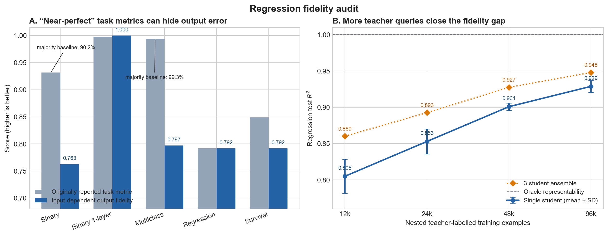

# Regression fidelity study

## Question

Why does the scalar regression student reach only about 0.8 test R² when the
classification and survival experiments appear nearly perfect, and can output
fidelity be improved without giving the student access to teacher parameters or
internal activations?

## Main conclusion

Regression is not uniquely failing. Accuracy and concordance are more tolerant
than continuous output R², and two classification teachers are strongly
imbalanced. When all tasks are evaluated on input-dependent teacher-output
variation, nonlinear binary classification, multiclass classification, and
survival also retain substantial error. The regression architecture can
represent the target exactly, but 12,000 examples provide limited coverage for
learning the random nonlinear
teacher function. More teacher-labelled examples are the only tested change
that consistently closes this gap for a single student.



## Experimental setup

Unless noted otherwise, experiments use the original defaults:

- 400 input genes, 60 pathways, pathway sizes 14–22, overlap 0.55;
- 12,000 training and 3,000 test examples;
- two 64-unit hidden layers;
- Adam, learning rate 0.002, batch size 512, 120 epochs;
- teacher seed 42, data seed 123, student seeds beginning at 9000;
- output-only teacher–student distillation.

The sparse first layer has 1,146 active weights and biases. Including the
downstream layers, the model has approximately 9,275 effective parameters, so
the original experiment has only about 1.29 training examples per effective
parameter.

## 1. Comparable metric audit

One student with seed 9000 was evaluated using continuous fidelity in addition
to each task's original metric.

| Task | Original task metric | Continuous teacher-output fidelity | Important context |
|---|---:|---:|---|
| Binary nonlinear | accuracy 0.932 | logit R² 0.763 | majority baseline 0.902; 52.2% of logits have `abs(logit) < 0.01` |
| Binary one-layer | accuracy 0.998 | logit R² 0.9999 | genuinely near-exact linear recovery |
| Multiclass | top-1 agreement 0.994 | dynamic-logit R² 0.797 | majority baseline 0.993; ordinary centered-logit R² 0.9965 is dominated by fixed class offsets |
| Regression | R² 0.792 | output R² 0.792 | continuous error is exposed directly |
| Survival | concordance 0.849 | risk-output R² 0.792 | teacher concordance is 0.941 |

Regression and survival have identical continuous output results because their
teacher/student architectures, seeds, amplified targets, and MSE training
objectives are identical. Survival only adds simulated times and evaluates the
same learned scores using concordance.

For multiclass, logits are first centered within each sample to remove the
arbitrary shift left unidentified by softmax, and then centered within each
class to remove fixed class offsets. The resulting dynamic-logit R² measures
the input-dependent signal. Its value of 0.797 shows that the deep nonlinear
tasks actually have remarkably similar functional fidelity; the apparently
perfect multiclass score is driven mainly by a nearly constant class preference.

## 2. Representability check

An oracle student was created by copying the teacher and applying the exact
affine transformation used to standardize and amplify the regression target.
It obtains train and test R² of 1.000000. Therefore:

- the student architecture has sufficient capacity;
- target amplification does not make the function unrepresentable;
- the observed gap comes from learning the function from finite output-only
  observations, not from a model-class mismatch.

The oracle is a diagnostic only and is not a valid output-only experiment.

## 3. Optimization and regularization screen

The original 12,000-example dataset was held fixed. Representative seed-9000
results were:

| Trial | Train R² | Test R² | Interpretation |
|---|---:|---:|---|
| Baseline, 120 epochs | 0.868 | 0.791 | original behavior |
| 360 epochs | 0.919 | 0.763 | more training overfits |
| 360 epochs + cosine decay | 0.889 | 0.789 | no material gain |
| Batch size 128 | 0.914 | 0.760 | more gradient steps overfit |
| Hidden width 128 | 0.933 | 0.786 | extra capacity raises train fit only |
| Unit-scale target | 0.911 | 0.780 | target amplitude is not the cause |
| Unit-scale curriculum | 0.902 | 0.790 | no material gain |
| Adam + L-BFGS | 0.873 | 0.791 | no material gain |
| Dropout 0.05, 90 epochs | 0.855 | 0.797 | small seed-specific gain |

Across five seeds, the baseline remained best on average:

| Trial | Mean test R² | SD |
|---|---:|---:|
| Baseline | 0.809 | 0.014 |
| Dropout 0.05 | 0.798 | 0.012 |
| Unit-scale curriculum | 0.792 | 0.021 |

Affine calibration learned on the training predictions did not improve test
R², showing that the residual error is not mainly a global scale or offset
mistake.

## 4. Nested, fixed-test sample-size experiment

One 96,000-example pool and one 3,000-example test set were generated once.
Training sets are nested prefixes of that pool, so the teacher and test cases
are identical at every sample size. Each point uses student seeds 9000–9002.

| Training examples | Single-student test R², mean ± SD | Three-student ensemble R² | Weight cosine | Activation correlation |
|---:|---:|---:|---:|---:|
| 12,000 | 0.805 ± 0.024 | 0.860 | 0.123 | 0.136 |
| 24,000 | 0.853 ± 0.017 | 0.893 | 0.109 | 0.124 |
| 48,000 | 0.901 ± 0.005 | 0.927 | 0.067 | 0.063 |
| 96,000 | 0.929 ± 0.008 | 0.948 | 0.018 | 0.012 |

An additional single-seed run with 192,000 examples reached test R² 0.961.
Because that run used a separately generated larger pool, it is supporting
evidence rather than part of the fixed-test curve.

The sample-size result is particularly relevant to the paper: output fidelity
improves from about 0.80 to 0.93 while internal recovery does not improve.
At 96,000 examples, mean activation R² is −50.9. Better prediction therefore
does not restore mechanistic identifiability.

## Recommended follow-up experiment

For a publication-quality extension:

1. Use the nested fixed-test sample-size design with at least 20 student seeds.
2. Include 12k, 24k, 48k, 96k, and 192k training examples.
3. Report continuous output R² for regression, survival risk, binary logits,
   and double-centered multiclass logits alongside the original task metrics.
4. Report single students as the primary result and ensembles as a separate
   predictive-performance control.
5. Keep the original 120-epoch Adam recipe initially; longer training on 12k
   examples is counterproductive.
6. Continue reporting weight and activation recovery to demonstrate the
   widening separation between functional fidelity and internal alignment.

## Reproduction

Metric audit:

```bash
python Code/task_fidelity_audit.py --students 1 --device cpu
```

Optimization screen:

```bash
python Code/regression_fidelity_study.py \
  --trials baseline,early_60,longer,cosine,small_batch,wide,unit_scale,curriculum,adam_lbfgs \
  --students 3 \
  --device cpu
```

Nested fixed-test sample-size experiment:

```bash
python Code/regression_sample_size_study.py \
  --sample_sizes 12000,24000,48000,96000 \
  --students 3 \
  --device cpu
```

Curated tables supporting the conclusions above are committed in
`Regression_Fidelity_Study/results/`. Full run outputs are written below
`results_regression_fidelity/`, which is ignored by the repository's existing
`*.csv` rule.
